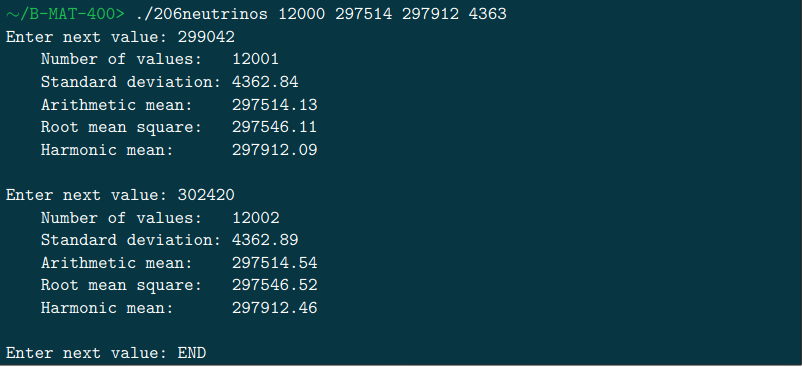

# 206neutrinos

ørgen-Olaf is a distinguished nuclear physics researcher in Hørsholm. With his assistant, they are studying
neutrinos, a kind of promising particle, and are trying to prove that these particles can travel faster than light.

Given temperature and pressure conditions, they record the speed of some particles under these conditions, modify one parameter, and start again.

Almost 11 months of hard work on several hundreds of millions
records. . .

They are unable to efficiently store all of these values. For each series of records, they only register:
1. its arithmetical mean,
2. its standard deviation,
3. its root mean square (Jørgen-Olaf needs an average speed so that if all the particles travel at this
speed, they would have the same total kinetic energy, which writes 1
2mv2),
4. its harmonic mean (as a precaution, in case Jørgen-Olaf would need another variable, with a non- quadratic dependency on speed).

Considering the size of the series, Jørgen-Olaf needs you to develop a software that will allow him to update
his data in real-time. This program will take 4 numbers as inputs (the number of recorded values, their
arithmetic mean, harmonic mean and standard deviation), and must:
1. wait for the next value to be written on the standard input,
2. print the number of recorded values, their standard deviation, arithmetic mean, root mean square
and harmonic mean,
3. return to the first step, except if the keyword END is entered.

## Compile

The project compile with *Makefile*:

For compile the project use the commande:

```console
foo@bar:~/206neutrinos$ make re
```

For clean the project use:

```console
foo@bar:~/206neutrinos$ make fclean
```

Get instruction with:


```console
foo@bar:~/206neutrinos$ ./206neutrinos -h
```

## Example

